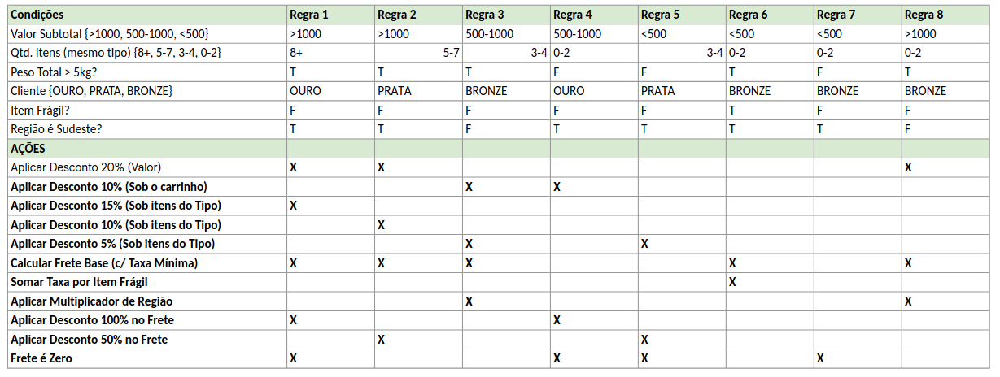
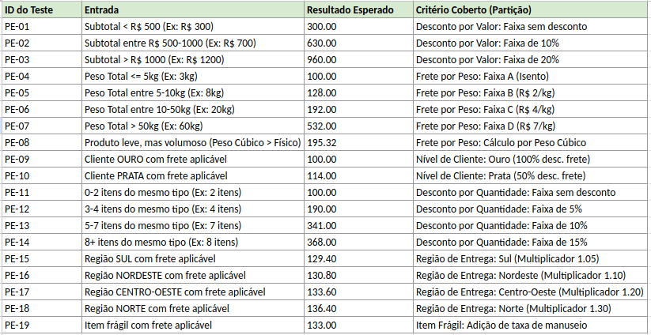
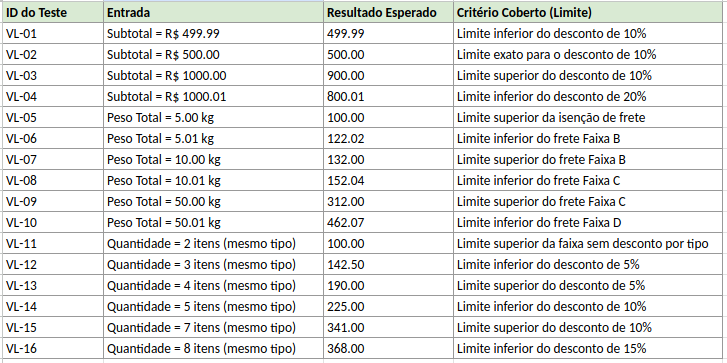
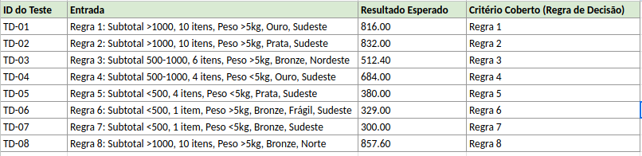
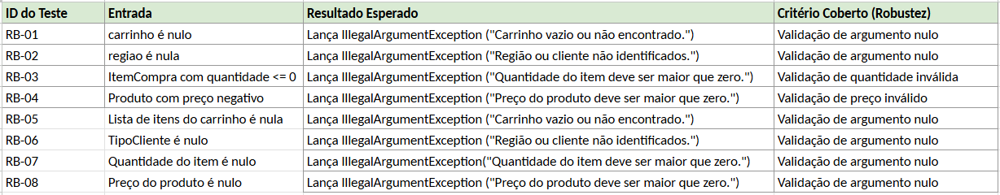
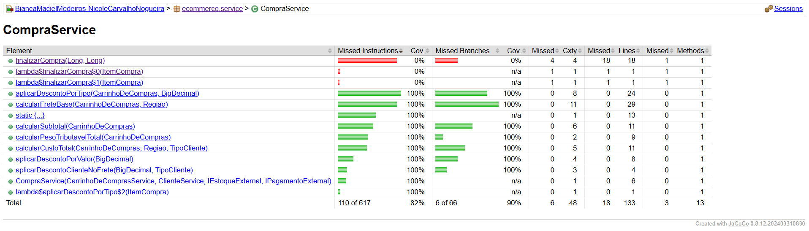
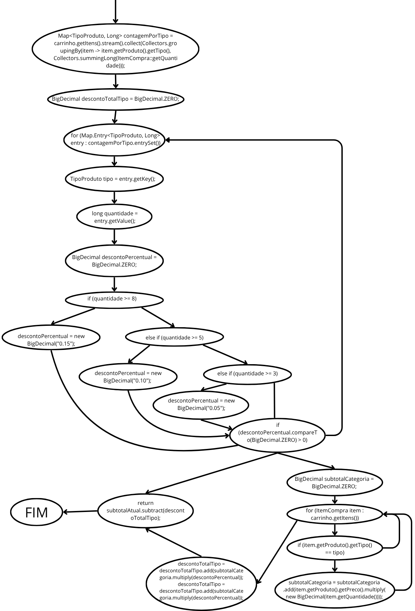

# Trabalho de Testes de Software: Finalização de Compra de E-commerce

Este projeto implementa e testa a funcionalidade de cálculo de custo total de uma compra em um sistema de e-commerce, como parte da avaliação da disciplina de Testes de Software.

**Membros do Grupo:**
* Bianca Maciel Medeiros
* Nicole Carvalho Nogueira

---

## 1. Como Executar os Testes

### Pré-requisitos
* Java JDK 17 (ou superior)
* Maven 3.8 (ou superior)

//TODO

## 3. Documentação e Projeto dos Casos de Teste de Caixa Preta

1) Identificação das Partições e Valores limites:

#### Desconto por Múltiplos Itens (mesmo tipo)
* Partições: 0-2,3-4, 5-7, 8-mais
* Valores Limites: 2, 3, 4, 5, 7, 8

#### Desconto por Valor do Carrinho
* Partições: Subtotal < R$ 500,00: Sem desconto ; R$ 500,00 ≤ Subtotal ≤ R$ 1000,00: 10% de desconto ; Subtotal > R$ 1000,00: 20% de desconto.
* Valores Limites: 499.99, 500.00, 1000.00, 1000.01

#### Cálculo do Frete Base (por Peso Total)
* Partições: 0 ≤ peso ≤ 5,00 kg: Isento ; 5,00 < peso ≤ 10,00 kg: R$ 2,00/kg ; 10,00 < peso ≤ 50,00 kg: R$ 4,00/kg ; peso > 50,00 kg: R$ 7,00/kg.
* Valores Limites: 0.00, 5.00, 5.01, 10.00, 10.01, 50.00, 50.01

#### Benefício de Nível do Cliente (no frete)
* Partições: Bronze: Paga o frete integral ; Prata: 50% de desconto no frete ; Ouro: 100% de desconto no frete.

#### Multiplicador de Frete por Região
* Partições: Sudeste: 1,00 ; Sul: 1,05 ; Nordeste: 1,10 ; Centro-Oeste: 1,20 ; Norte: 1,30.

#### Taxa Item Frágil
* Partições: Item é frágil: Adiciona R$ 5,00 por quantidade ao frete ; Item não é frágil: Nenhuma taxa extra.

#### Taxa Mínima Frete
* Partições: Peso > 5,00 kg: Soma taxa mínima de R$ 12,00 ; Peso ≤ 5,00 kg: Não soma taxa mínima.
* Valores Limites: 5.00, 5.01

2) Tabela de Decisão:
   

3) Documentação dos testes de partição:
   

4) Documentação dos testes de fronteira:
   

5) Documentação dos testes baseado na Tabela de decisões:
   

6) Documentação dos testes de robustez:
   

## 4. Documentação e Projeto dos Casos de Teste de Caixa Branca

### Cobertura



### Grafo de Fluxo de Controle (CFG)

calcularCustoTotal:

.png)

calcularSubtotal:

.png)

aplicarDescontoPorTipo:



aplicarDescontoPorValor:

.png)

calcularFreteBase:

.png)

aplicarDescontoClienteNoFrete:

.png)

calcularPesoTributavelTotal:

.png)

### Cálculo da Complexidade Ciclomática

Calculemos, inicialmente, método por método:

 calcularCustoTotal:

     if (carrinho == null || ...): 1
     if (regiao == null || ...): 1

     Subtotal: 2 decisões

 calcularSubtotal:

     for (ItemCompra item : ...): 1
     if (item.getQuantidade() == null || ...): 1
     if (item.getProduto().getPreco() == null || ...): 1
     
     Subtotal: 3 decisões

 aplicarDescontoPorTipo:

     for (Map.Entry ...): 1
     if (quantidade >= 8): 1
     else if (quantidade >= 5): 1
     else if (quantidade >= 3): 1
     if (descontoPercentual.compareTo(...) > 0): 1
     for (ItemCompra item : ...): 1
     if (item.getProduto().getTipo() == tipo): 1

     Subtotal: 7 decisões

 aplicarDescontoPorValor:

     if (subtotal.compareTo(...) > 0): 1
     else if (subtotal.compareTo(...) >= 0): 1 (Você corrigiu o bug, mas a contagem continua a mesma)
     if (descontoPercentual.compareTo(...) > 0): 1
     
     Subtotal: 3 decisões

 calcularFreteBase:

     if (pesoTotal.compareTo(...) <= 0): 1
     else if (pesoTotal.compareTo(...) <= 0): 1
     else if (pesoTotal.compareTo(...) <= 0): 1
     if (!isento): 1
     for (ItemCompra item : ...): 1
     if (item.getProduto().isFragil()): 1
     switch (regiao): 5 (case SUL, NORDESTE, CENTRO_OESTE, NORTE, SUDESTE)

     Subtotal: 11 decisões

 aplicarDescontoClienteNoFrete:

     switch (tipoCliente): 3 (case OURO, PRATA, BRONZE)
     Subtotal: 3 decisões

 calcularPesoTributavelTotal:

     for (ItemCompra item : ...): 1
     Subtotal: 1 decisão

Cálculo Final:

      Total de Pontos de Decisão = 2 + 3 + 7 + 3 + 11 + 3 + 1 = 31
      Complexidade Ciclomática (V(G)) = (Total de Decisões) + 1 = 31 + 1 = 32

A Complexidade Ciclomática (V(G)) calculada para a funcionalidade de calcularCustoTotal, considerando todos os seus métodos auxiliares, é 32. Isso indica que são necessários, no mínimo, 32 casos de teste independentes para garantir a cobertura de todas as arestas do código.

No nosso projeto, nos temos 51 testes totais, o que ultrapassa o mínimo e garante cobertura de todas as arestas.

#### c) Cobertura MC/DC (Modified Condition/Decision Coverage)
O critério MC/DC foi aplicado na decisão composta mais complexa da lógica de negócio para garantir que cada condição individual afeta independentemente o resultado da decisão.

**Decisão Analisada (do método `calcularSubtotal`):**
```java
if (item.getProduto().getPreco() == null || item.getProduto().getPreco().compareTo(BigDecimal.ZERO) < 0)
```

* **Condição A:** `item.getProduto().getPreco() == null`
* **Condição B:** `item.getProduto().getPreco().compareTo(BigDecimal.ZERO) < 0`

**Tabela MC/DC:**

| ID do Caso de Teste | Condição A (`preco == null`) | Condição B (`preco < 0`) | Resultado da Decisão (Lança Exceção?) | Independência Demonstrada |
| :--- | :---: | :---: | :---: | :--- |
| **RB-08** | **Verdadeiro** | - (`don't care`) | **Verdadeiro** | **Par com (3)** para testar a independência de **A** |
| **RB-04** | Falso | **Verdadeiro** | **Verdadeiro** | **Par com (3)** para testar a independência de **B** |
| **PE-01 (ou qualquer teste válido)** | Falso | **Falso** | **Falso** | Par de referência (resultado Falso) |

Esta análise confirma que os testes de robustez (`RB-04` e `RB-08`) satisfazem o critério MC/DC para a validação de preço do produto.

---
